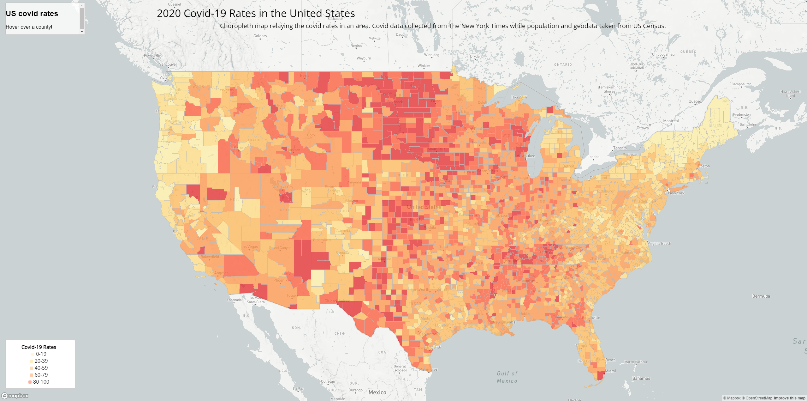
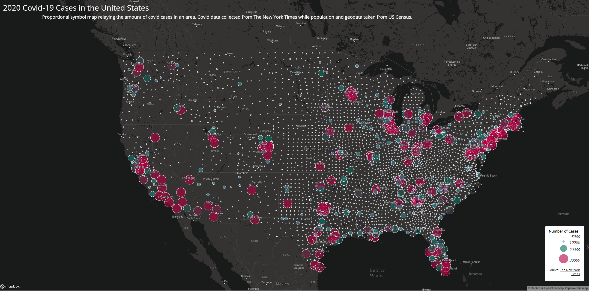

# Mapping Covid 19 in 2020
This is a project that undertakes web mapping using the library "mapbox" to create two maps that describe the situation with covid 19 in the year 2020. Covid put the world on notice as the pandemic brought everything to a hold for many years. It resulted in millions dying and new policies being created to hopefully prevent something like it happening again. Map1 is a choropleth map that uses color to show how high the covid rates are for each US county. The case rate is calculated as cases per thousand residents. This allows for case numbers to be normailzed based on how high the population is. The second map is a proportional symbols map that uses various sizes of circles to show how high a case count is for each county. The larger the circle, the higher the number of cases for that area. All this was done using data that was acquired from various sources. The COVID-19 case/death data that was used is originally from The New York Times. The data includes all the cases in 2020. The population data used for calculating the case rates are from the 2018 ACS 5 year estimates. Both data are at the county level. The U.S. county boundary shapefile was downloaded from the U.S. Census Bureau. 

## Map1, Choropleth Map of Covid-19 Rates

### Link to the map:

## Map2, Proportional Symbol Map of Covid-19 Cases

### Link to the map:
